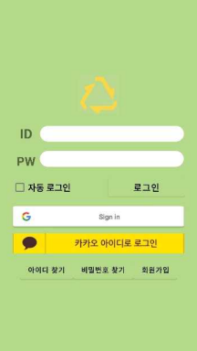
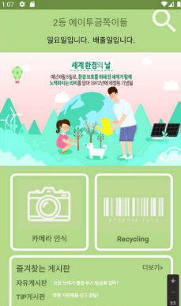

# 🗑️ 올바른 쓰레기 배출 안내 애플리케이션
**👥 디투금쪽이들**

> 일상 속에서 발생하는 쓰레기를 올바르게 배출하고, 관련 법과 벌금 정보를 함께 안내하는 환경 보호 실천 앱

## 📱 소개

쓰레기 배출 기준을 잘 몰라 발생하는 **환경오염**, **주민 불편**, **벌금 문제**를 해결하고자 이 애플리케이션을 개발

- 쓰레기 종류별 분리배출 방법 안내  
- 불법 투기 시 벌금 및 관련 법률 정보 제공  
- 환경 관련 행사 및 기념일 소개  

## 🛠 기술 스택

## 📸 스크린샷

  
  
  

## 📌 주요 기능

- 생활 쓰레기 종류별 배출 방법 제공
- 잘못된 배출 시 발생 가능한 법적 처벌 기준 안내
- 환경 기념일, 캠페인 등의 정보 제공
- 사용자 친화적인 UI

## 🔧 개발 단계

### 1. 요구분석 및 정의
- 관련 법률 및 환경 지침 수집
- 애플리케이션 기능 도출

### 2. 설계
- 전체 UI 및 기능 흐름도 설계
- 데이터베이스 구조 설계

### 3. 구현
- Android Studio에서 Java 기반 기능 구현
- XML을 이용한 UI 구성

### 4. 테스트
- 기능 통합 및 시나리오 기반 테스트 수행

### 5. 운영 및 유지보수
- 피드백 반영 및 기능 개선
- 데이터/법률 정보 업데이트
